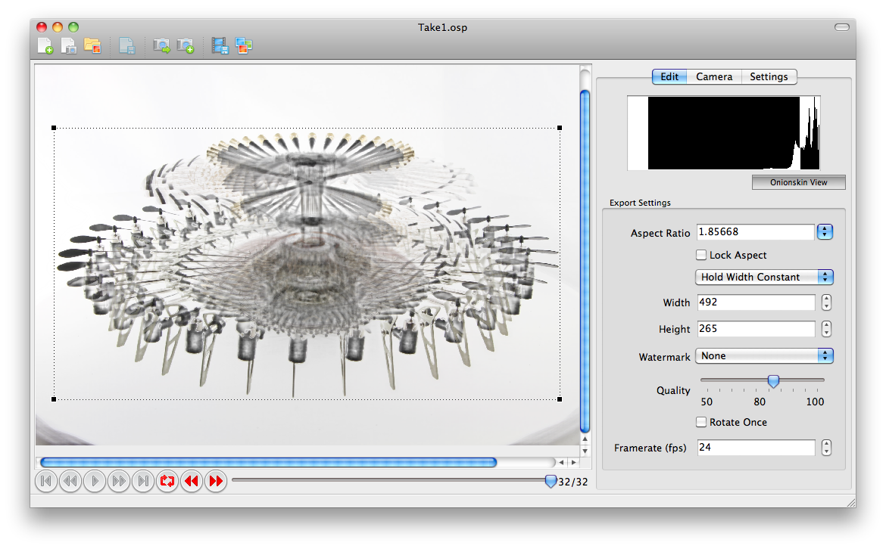

.. |add| image:: ../src/icons/page_white_add.png
   :height: 16pt
.. |capture| image:: ../src/icons/camera_add.png
   :height: 16pt
.. |stop| image:: ../src/icons/cancel.png
   :height: 16pt
.. |save| image:: ../src/icons/page_save.png
   :height: 16pt
.. |forward| image:: ../src/icons/control_forward.png
   :height: 16pt

.. |export| image:: ../src/icons/film_save.png
   :height: 16pt
.. |exportimages| image:: ../src/icons/images.png
   :height: 16pt
.. |onionbutton| image:: onionbutton.png
   :height: 14pt
   :alt: Onionskin View

.. |newproject| image:: newproject.png
   :width: 240pt
.. |histogram| image:: histogram.png
   :width: 240pt

Advanced Functions
==================

Reshooting Frames
-----------------

You can retake any frame by using the slider at the bottom to select it and then clicking |set|. 

|slider|

After turntable has turned to that position, capture photo by clicking |capture| or **Capture→Capture Picture**.

Object Actions
--------------

You can easily add object animations to your rotating object. Just shoot the 360° view normally, then select frames where you would like the action take place. Go to that frame by using the slider at the bottom to select it and then clicking |set|. Now carefully perform the action on your object making sure that it stays at the same spot. Then capture photo by clicking |capture| or **Capture→Capture Picture**.

.. note::

   If you have disturbed the position of the object, just reposition it and take another photo.

Annotation
----------

It's very easy to annotate parts of the object. Right-click and select **Add New Tag**.

|rightclick|

Then enter the annotation text.

|newtag|

Now position and resize the new annotation to your liking.

|tag|

Repeat the process for any frames that you need to annotate.
