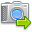

.. |capture| image:: ../src/icons/camera_add.png
   :height: 16pt

.. |stop| image:: ../src/icons/cancel.png
   :height: 16pt

.. |set| image:: ../src/icons/control_repeat.png
   :height: 16pt
.. |export| image:: ../src/icons/film_save.png
   :height: 16pt

.. |onionskin| image:: onionskin.png
   :width: 480pt

.. |histogram| image:: histogram.png
   :width: 240pt
.. |slider| image:: slider.png
   :width: 480pt
   
Automatic Capture
=================

Automatic capture allows to shoot and export 360° views in minutes.

Create a new project by clicking |add| or **File→New**:

|newproject|

Input project name and project directory and then select the number of images to capture per rotation and click **Start**.

.. note::

   Make sure camera and turntable are connected and turned on.

Capture photo by clicking |capture| or **Capture→Capture Picture**.

Start automatic capture by clicking |automatic| or *Capture→Start*

.. note::

   You can click |stop| at any time to stop automatic capture, then restart it where it left off my clicking |automatic| again.

.. note::

   You can retake any frame by using the slider at the bottom to select it and then clicking |set|. 

Once capture is completed, you can save the project with |save| or **File→Save**.

|onionskin|

Now press the |onionbutton| button in the **Edit** tab and crop the image to your liking.
Press that button again to turn off the onionskin view.

Adjust the histogram to your liking. It can be used to whiten not completely white background.

|histogram|

Use the slider at the bottom to switch between frames to look at the result.

|slider|

Now you can :doc:`export <export>` the 360 degree view to Web, Flash or GIF using the |export| button or **File→Export 360° View**.