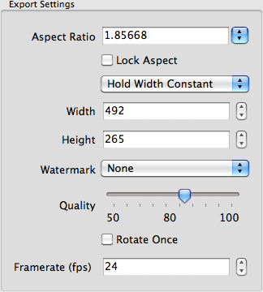

.. |export| image:: ../src/icons/film_save.png
   :height: 16pt

Export
======

Open or create a new project and capture images. Once you are happy with the capture, you can export the 360° view to Web, Flash or GIF.

First edit the export settings:

|exportsettings|

Then click the |export| button or **File→Export 360° View** and then select file format and enter file name.